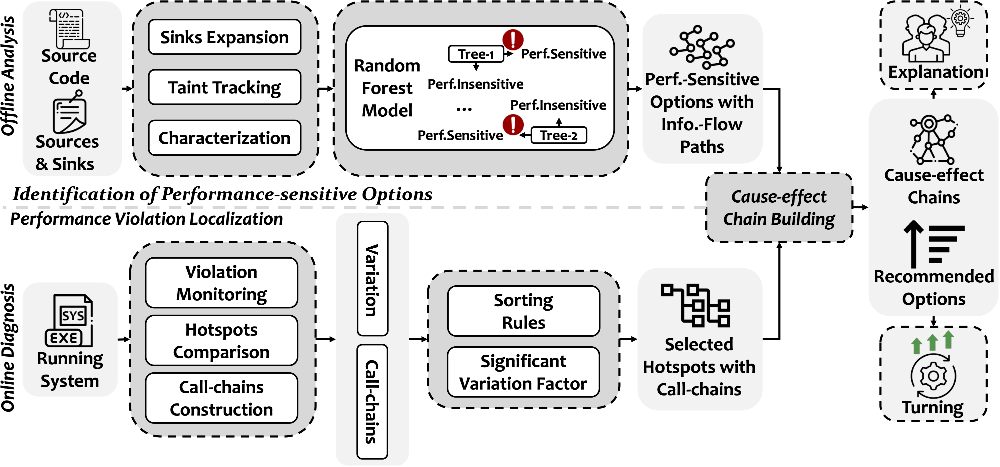
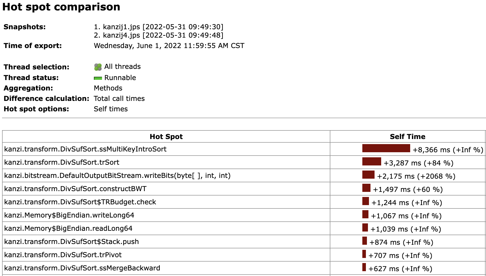

# Artifacts of DiagConfig
This repository includes the artifacts (including data and source code) of the paper: "DiagConfig: Configuration Diagnosis of Performance Violations in Configurable Software System"
## Overview of DiagConfig


*DiagConfig* is a white-box configuration diagnosis system and is general enough to adapt to software systems under different configurations, workloads, and environments. It consists of two parts: 1) *offline analysis*, and 2) *online diagnosis*. 

- *Offline analysis* identifies performance-sensitive options by revealing the dependencies between options and performance-related operations. 
This procedure requires two inputs: 1) the target system’s source code, and 2) a list of specific prerequisites. The prerequisites contain statements that load configuration option values (as sources) and performance-related operations (as sinks) in the source code. 
 It builds information-flow paths from option values to performance-related operations via taint tracking, extracts options' static performance properties, and then classifies performance-sensitive options and information-flow paths. 
 
- *Online diagnosis* continuously monitors system runtime behavior, locates performance-violating hotspot functions, and collects call-chains for the performance-violating hotspot functions from the profiling. It builds cause-effect chains with information-flow paths and call-chains, which further reveals the data- or control-flow dependency between individual options and performance-violating hotspot functions.
When a new performance violation occurs, *DiagConfig* can apply these cause-effect chains to guide diagnosis and to recommend crucial configuration options for performance tuning.
It can work as a daemon process that continuously analyzes performance-violating configuration options for auto-tuning.

## How to use DiagConfig
### Offline analysis
#### Taint Tracking
We utilizes the [FlowDroid](https://github.com/secure-software-engineering/FlowDroid) to support configuration options taint tracking. 
By treating configuration loading statements as *sources* and performance-related operations as *sinks*, it reveals the direct data dependency between the options and the operations. But the if/switch-related and loop-related control dependencies are missed out. Therefore, we slightly modified the sink manager component of FlowDroid with program-dependence graphs for our purposes 
to mark *if/switch* statements with branches containing performance-related operations and *loop* startup/jump-out statements with body containing performance-related operations as *expanded sinks*. Then, if the conditions of if/switch statements or loop startup/jump-out statements have a direct data dependency with an option, there is if/switch-related or loop-related dependency between the option and the operations inside the branches or loop body. We also customized FlowDroid's source manager component to support those systems without standard configuration loading operations. Additionally, we set the depth of alias analysis at five for FlowDorid to balance the taint tracking precision and computational overhead. This is the default value provided by FlowDroid, and the larger the depth the higher the taint tracking overhead required. 
##### Code Sample Snippet
Check out these files below to quickly perform configuration options taint tracking for existing systems and learn how to adopt DiagConfig for new systems.
```
taint-analysis/analyzer/src/main/java/edu/sysu/jimmy/runner
.
|-- AnalyzeBatikSVG.java
|-- AnalyzeCassandra.java
|-- AnalyzeCatena.java
|-- AnalyzeDconverter.java
|-- AnalyzeH2.java
|-- AnalyzeKanzi.java
|-- AnalyzePrevayler.java
`-- AnalyzeSunflow.java
```
#### Characterization and Identification of Performance-Sensitive Options


### Online diagnosis
#### Performance Violation Localization
The goal of this step is to detect the performance-violating hotspot functions based on performance measurements for the selected metrics. 
*DiagConfig* first leverages an off-the-shelf profiler, [Jprofiler](https://www.ej-technologies.com/index.html), to continuously monitor the end-to-end performance of a system [in sampled-based mode](https://www.ej-technologies.com/resources/jprofiler/help/doc/main/methodCallRecording.html). When an SLO violation is detected in the end-to-end performance measurement, it collects hotspot functions from the profiler. By [comparing](https://www.ej-technologies.com/resources/jprofiler/help/doc/commandLine/snapshotExecutables.html) the execution time of hotspot functions in the performance violated situation and the normal baseline execution, *DiagConfig* calculates the performance variation of each hotspot function. Most off-the-shelf profilers are capable to measure the execution time of each hotspot function excluding the callee's performance influence. Thus, *DiagConfig* determines that a hotspot function with a significant performance variation is performance-violating. In our paper, we choose the significant variation factor to be 5\%. 
##### Localization Example


#### Cause-effect Chain Building
*DiagConfig* backtracks the call-chains of hotspot functions and analyzes the callsite at the statement/block-level to determine whether there are program-dependencies between the performance-violating hotspot functions and performance-related operations. When a hotspot function in the call-chains involves performance-related operations or is called by the operations, *DiagConfig* correlates the corresponding information-flow paths and the call-chains to construct trackable cause-effect chains (i.e., conditional pairs consisting of information-flow paths and call-chains). 
Associating performance variations of hotspot functions with options corresponding to information-flow paths allows for quantifying and ranking options' importance. 

#### Code Sample Snippet
Check out the file `taint-analysis/analyzer/src/main/java/edu/sysu/jimmy/runner/Diagnosis.java` to learn how to adopt DiagConfig for new systems.

##### Cause-effect Chain Example
See `raw_data_for_plots/chap3/example/cause-effectChains.json` for details.

## Quick Evaluation
### Environment
JDK Version
```shell
$ java -version
openjdk version "1.8.0_345"
OpenJDK Runtime Environment (build 1.8.0_345-b01)
OpenJDK 64-Bit Server VM (build 25.345-b01, mixed mode)
```
Maven Version
```shell
$ mvn -v
Apache Maven 3.6.3 (cecedd343002696d0abb50b32b541b8a6ba2883f)
Maven home: /usr/local/maven/apache-maven-3.6.3
Java version: 1.8.0_345, vendor: BellSoft, runtime: /usr/local/java/jdk8u345/jre
Default locale: en_US, platform encoding: ANSI_X3.4-1968
OS name: "linux", version: "4.19.86", arch: "amd64", family: "unix"
```
### Taint Tracking
Please execute the following files to evaluate the configuration options taint tracking.
```
taint-analysis/analyzer/src/main/java/edu/sysu/jimmy/runner
.
|-- AnalyzeBatikSVG.java
|-- AnalyzeCassandra.java
|-- AnalyzeCatena.java
|-- AnalyzeDconverter.java
|-- AnalyzeH2.java
|-- AnalyzeKanzi.java
|-- AnalyzePrevayler.java
`-- AnalyzeSunflow.java
```
The results of taint tracking will then fill the following directory: 
`taint-analysis/subjectSys/output`.
### Identification of Performance-Sensitive Options
Please see the file `modeling/m2.ipynb` for reproduce the results of identification of performance-sensitive options.

### Diagnosis of Configuration Changes
1. Extract the following archived performance measurement data to any directory: [](https://doi.org/10.5281/zenodo.8100205)
2. Modify the `monitoring_output_path` in the following file to the extracted target directory in the first step: `taint-analysis/analyzer/src/main/java/edu/sysu/jimmy/runner/Diagnosis.java`
3. Execute the file `taint-analysis/analyzer/src/main/java/edu/sysu/jimmy/runner/Diagnosis.java`, and the result is then printed to the console as a log.

## Repository Structure
```
.
|-- dataset # Public dataset for comparison of DiagConfig with its alternatives.
|-- modeling # Our persistent random forest classification model.
|-- monitoring_output # Part ot performance measurement of the sampled configuration.
|-- random_forest # Visualization of the random forest model, which contains visualization of features.
|-- raw_data_for_plots # Part of raw data used to plot the figures and tables in the paper.
`-- taint-analysis # Source code for configuration option taint tracking and cause-effect chain buidling.
```

## 📘&nbsp; License
DiagConfig is released under the terms of the [MIT License](./LICENSE).